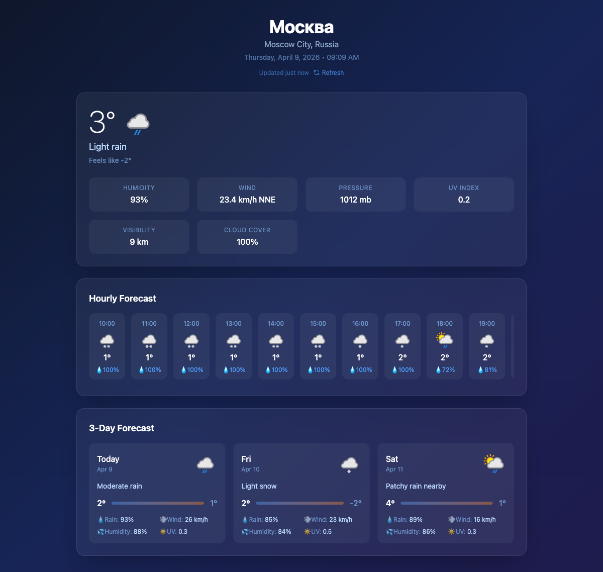
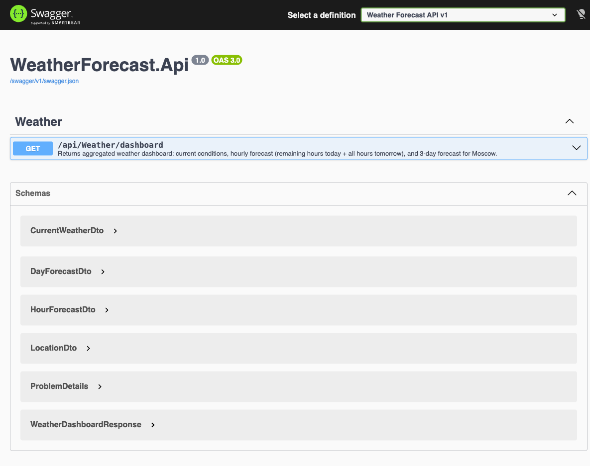

# Weather Forecast

> **Test Assignment** for Full Stack .NET Senior position at **Power International Tires** (Пауэр Интернэшнл-шины) — one of the largest federal distributors of tires and wheels in Russia, with over 1,300 employees across 28 offices nationwide.

A high-performance weather web application built with **.NET 10** and **React + TypeScript**, following **Clean Architecture** and **CQRS** patterns.

Displays current weather, hourly forecast (remaining hours today + all hours tomorrow), and a 3-day forecast for **Moscow**, powered by [WeatherAPI.com](https://www.weatherapi.com/).

## Screenshots

### Weather Dashboard


### Swagger API Documentation


## Architecture

```
WeatherForecast/
├── src/
│   ├── WeatherForecast.Domain/            # Entities, Value Objects (zero dependencies)
│   ├── WeatherForecast.Application/       # MediatR Queries, Interfaces, DTOs, Behaviors
│   ├── WeatherForecast.Infrastructure/    # WeatherAPI HTTP client, Caching, Resilience
│   ├── WeatherForecast.Api/              # ASP.NET Core Web API Host
│   └── WeatherForecast.Client/           # React + Vite + TypeScript SPA
├── tests/
│   ├── WeatherForecast.Application.Tests/ # Unit tests (MediatR handlers)
│   ├── WeatherForecast.Infrastructure.Tests/ # Integration tests (WireMock)
│   └── WeatherForecast.Api.Tests/         # API integration tests (WebApplicationFactory)
├── docker-compose.yml
├── Dockerfile                             # API multi-stage build
├── Dockerfile.client                      # React -> Nginx
└── nginx.conf                             # SPA routing + API reverse proxy
```

### Dependency Flow

```
Domain <- Application <- Infrastructure
                ^              ^
                |              |
                +---- Api -----+
```

## High-Load Design

| Pattern | Implementation |
|---------|---------------|
| **Multi-Layer Caching** | L1: In-Memory (5 min) + L2: Redis (15 min), cache-aside pattern |
| **Resilience** | Retry (3x exponential backoff), Circuit Breaker, Timeout (10s/30s) via `Microsoft.Extensions.Http.Resilience` |
| **Rate Limiting** | Fixed window (100 req/min per IP) + Sliding window (1000 req/hour) |
| **Background Warmup** | `WeatherCacheWarmupService` pre-warms cache every 10 min — first request always from cache |
| **Response Compression** | Brotli + Gzip |
| **Performance Monitoring** | `X-Response-Time` header, `PerformanceBehavior` logs slow requests (>500ms) |
| **Structured Logging** | Serilog with Console + File sinks, `LoggerMessage` source generators for zero-alloc logging |

## Tech Stack

### Backend
- .NET 10
- ASP.NET Core Web API
- MediatR (CQRS pipeline)
- FluentValidation
- Serilog
- Swagger / OpenAPI
- Redis (distributed cache)
- xUnit + NSubstitute + FluentAssertions + WireMock.Net

### Frontend
- React 19 + TypeScript
- Vite 6
- Tailwind CSS 4
- Axios

## Getting Started

### Prerequisites
- [.NET 10 SDK](https://dotnet.microsoft.com/download)
- [Node.js 22+](https://nodejs.org/)
- [Docker](https://www.docker.com/) (optional, for Redis)

### Run with Docker (recommended)

```bash
docker compose up --build
```

This starts all 3 services:

| Service | URL | Description |
|---------|-----|-------------|
| **Client (UI)** | http://localhost:3000 | React SPA served by Nginx |
| **API** | http://localhost:5000 | .NET Web API |
| **Redis** | localhost:6379 | Distributed cache (L2) |

Nginx reverse-proxies `/api/*` requests from the client to the API, so the UI works seamlessly at http://localhost:3000.

### Run Locally (Development)

**Backend:**

```bash
cd src/WeatherForecast.Api
dotnet run
# API: http://localhost:5000
# Swagger: http://localhost:5000/swagger
# Health: http://localhost:5000/health
```

**Frontend:**

```bash
cd src/WeatherForecast.Client
npm install
npm run dev
# UI: http://localhost:5173 (proxies /api to backend)
```

### Run Tests

```bash
dotnet test -c Release
```

## API Endpoints

| Method | Path | Description |
|--------|------|-------------|
| `GET` | `/api/weather/dashboard` | Aggregated weather dashboard (current + hourly + 3-day forecast) |
| `GET` | `/health` | Health check |
| `GET` | `/swagger` | Swagger UI |

### Sample Response

```json
{
  "location": {
    "name": "Moscow",
    "region": "Moscow City",
    "country": "Russia",
    "timeZone": "Europe/Moscow",
    "localTime": "2026-04-09T14:30:00"
  },
  "current": {
    "tempCelsius": 22.0,
    "feelsLikeCelsius": 20.0,
    "humidity": 55,
    "conditionText": "Partly cloudy",
    "conditionIconUrl": "https://cdn.weatherapi.com/weather/64x64/day/116.png"
  },
  "hourlyForecast": [...],
  "dailyForecast": [...]
}
```

## Configuration

All configuration is in `appsettings.json`:

```json
{
  "WeatherApi": {
    "BaseUrl": "http://api.weatherapi.com",
    "ApiKey": "your-api-key",
    "TimeoutSeconds": 10
  },
  "Cache": {
    "UseRedis": false,
    "RedisConnectionString": "localhost:6379"
  }
}
```

Set `Cache:UseRedis` to `true` and provide `RedisConnectionString` to enable Redis L2 cache. Without Redis, the app uses in-memory distributed cache (single-instance mode).

## Testing Strategy

| Layer | Type | Tools | Count |
|-------|------|-------|-------|
| Application | Unit | xUnit, NSubstitute, FluentAssertions | 4 |
| Infrastructure | Integration | xUnit, WireMock.Net, FluentAssertions | 4 |
| API | Integration | xUnit, WebApplicationFactory, NSubstitute | 5 |

**Total: 13 tests**

## License

MIT
